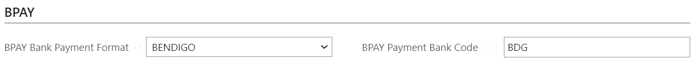
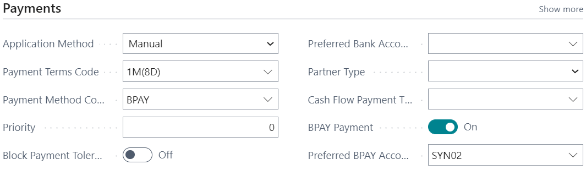
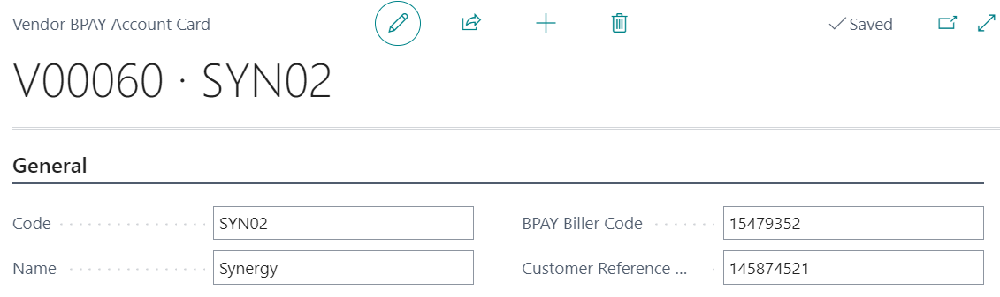
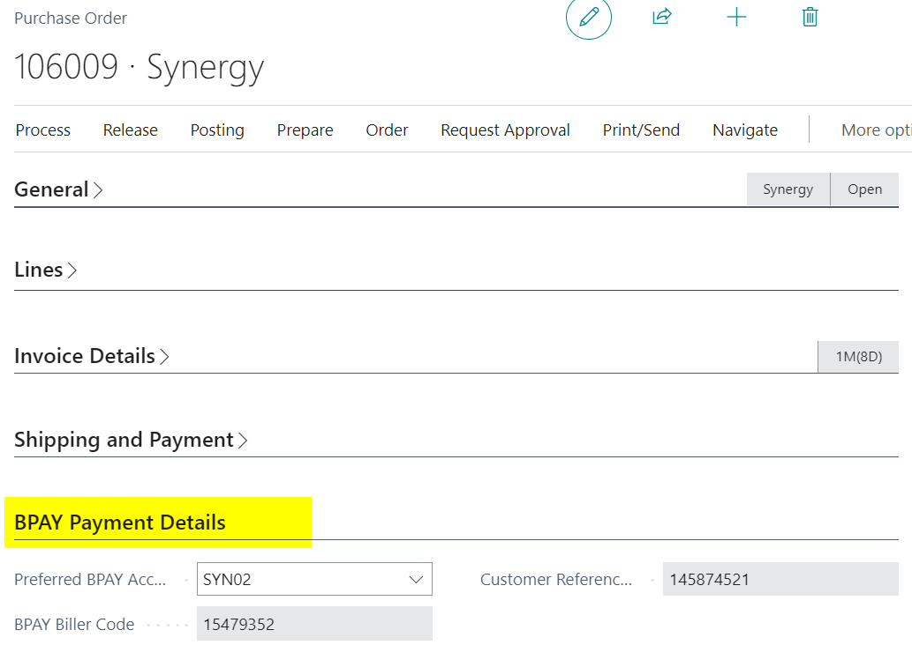
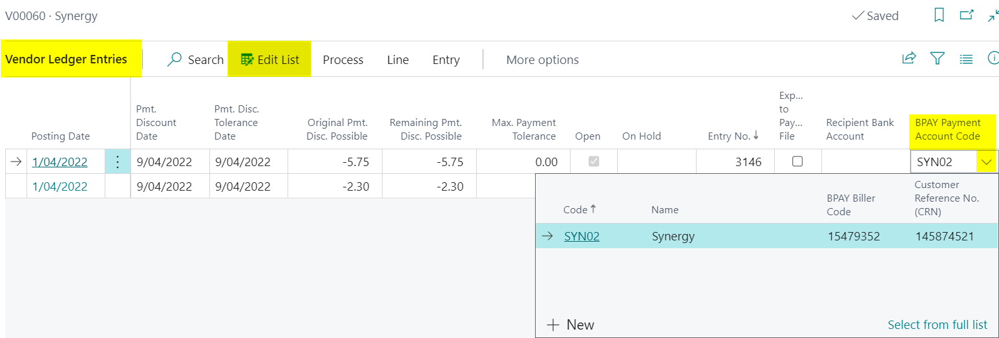

The BPAY Payments app has been designed so it can be used with a minimum amount of setup. There are a couple of things that need to be in place before you can start to work through the usage scenarios.

## Permissions

The BPAY Payments app permission sets can be seen by going to the *Permission Sets* page and searching for BPAY Payments.

There is only one permission set for the BPAY Payments app, so assign this permission set to any users that need to work with the app.

## Pay-from Bank Accounts

To use a bank account as a pay-from bank account for BPAY payments, you must have a *BPAY Bank Payment Format* and *BPAY Payment Bank Code* configured with values that indicate which file format is to be used.

## Vendor

To pay a Vendor via BPAY Payments you must set the *BPAY Payment* field to True, and add a *Preferred BPAY Account Code*.

## Vendor BPAY Accounts

To create a new BPAY account for a Vendor select *Related > Vendor > BPAY Accounts*, or use the lookup from the *Preferred BPAY Account Code* field and then *New*.

Complete the fields on the General FastTab:

* Code
* Name
* BPAY Biller Code
* Customer Reference No. (CRN)

!!! info
    You will find this information on your vendor invoice.

## Purchase Document

BPAY Payment information can be found on the following documents:

* Purchase Quote
* Purchase Order
* Purchase Invoice

Complete/update the pre-filled data (defaulted from the Vendors Preferred BPAY Account) on the BPAY Payment Details FastTab then Post the purchase document:

* Preferred BPAY Account Code
* BPAY Biller Code
* Customer Reference No.(CRN)

This information will be posted to the vendor ledger entry.

## Vendor Ledger Entry

If you need to add this information after you have posted the purchase document, you can do so from the vendor ledger entry.

