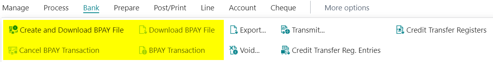
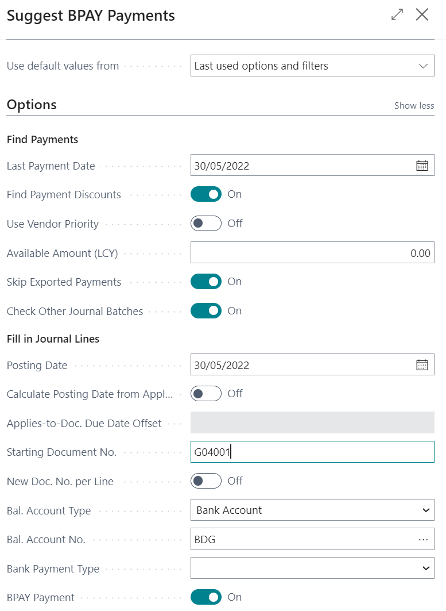
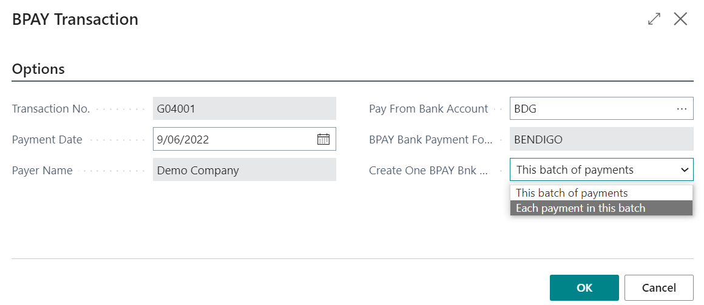
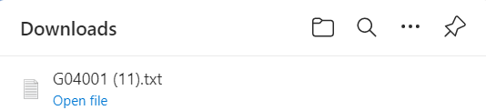
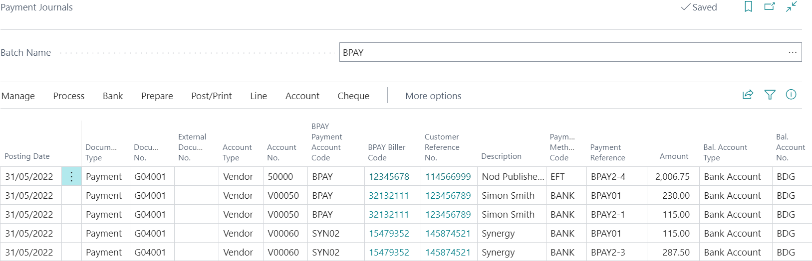
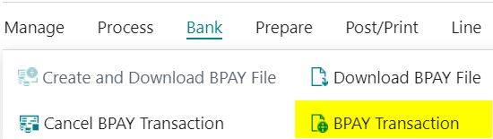
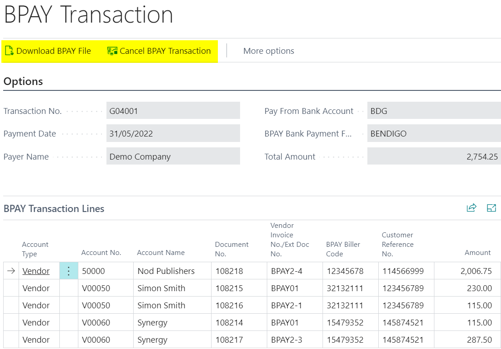
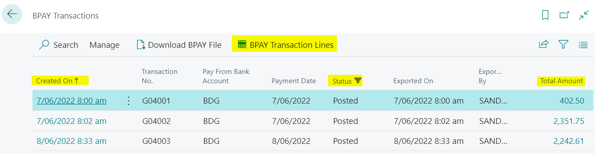

BPAY payments are based on payment journals which can be generated by the *Suggest Payments* function or by keying lines in to the journal.

!!! info
    Specify the number series for the BPAY payment transaction against the payment journal batch.

## New Commands Overview

This extension adds a number of new actions to the *Bank* menu in the command bar on the Payment Journal page.

| New Command | Description |
| --- | --- |
| **Create and Download BPAY File** | Once your payment journal is filled with the payments you wish to make, this option will create a BPAY file. If there are no validation errors, your BPAY file will be downloaded ready for you to transfer to the bank software. |
| **Cancel BPAY Transaction** | After creating and downloading the BPAY file, the payment journal lines will be locked to prevent further changes. If you wish to cancel the BPAY Transaction and re-enable editing of the payment journal lines, you can use this option. The option is only available if the status of the BPAY Transaction is currently *Exported*. |
| **Download BPAY File** | You can use this option to download the BPAY file again without regenerating the BPAY Transaction. This option will only be available when the status of the BPAY Transaction is currently *Exported*. |
| **BPAY Transaction** | This option will only be available when the status of the BPAY Transaction is *Exported*. The option will take you to the BPAY Transaction page where you can send remittances, print remittances, download the previously export file, cancel the BPAY transaction or review the details. |

## 

## Pay Vendors Using BPAY

Typically the steps needed to pay vendors using BPAY are:

* Suggest Payments
* Create and Download BPAY File
* Process BPAY file in Bank Software
* Post Payment Journal

### Suggest BPAY Payments

Setup your Payment Journal batch for BPPAY payments with a *Bal. Account Type* of Bank Account, and a *Bal. Account No.* of the BPAY bank account you are paying from.

You now use the standard suggest vendor payments option with the filters you require, then select *BPAY Payment* and complete the preparation of the payment journal as usual.

Suggest BPAY Payments will populate Payment Journals lines with:

* Vendor Ledger Entries related to a *BPAY Vendor* (Vendor Card / BPAY Payments / BPAY Payments – True).
* Vendor Ledger Entries that have *Biller Code* completed

!!! info
    If you have already posted the purchase Invoice and not completed the
    BPAY Payment Account Code
    you can add this against the
    vendor ledger entry
    prior to running the Suggest BPAY Payments.

### 

### Create and Download BPAY File

Once your payment journal has been approved, select *Bank > Create and Download BPAY File*. The BPAY Transaction request page is shown with values defaulted from the last run.

If you have setup your payment journal batch with a default Type of Bank and Bank account number this will be suggested as the Pay From Bank Account.  If you haven't then use the ... to select the correct BPAY bank account.

Select the option for *Create One BPAY Bnk transaction for* :

* This batch of Payments  - this will create one balancing line for the payment journal
* Each payment in this batch  - this will complete the Bal. Account Type and Bal. Account No. on each line in the payment journal

Select OK.

Successful generation will result in the following:

1. Prompt to open or save the file  
    
2. Payment lines are updated with Balance Account for each line (Each payment in this batch option chosen)
3. A BPAY Transaction record is created to represent the file. From the payment journal select *Bank / BPAY Transaction* to view.  
   The BPAY Transaction record may also be accessed from the menu > search *BPAY Transaction*
4. Fields on the payment journal are now locked and cannot be changed unless the BPAY transaction is cancelled.   The exception to this is the dimensions which can be changed using > *Related / Line / Dimensions*.

The payment journal may now be posted in the usual way.

!!! info
    It is a common business process to wait until the file has been successfully loaded to the banking application before posting the payment journal.

## Download BPAY File (Copy)

A copy of the BPAY file can be downloaded from the unposted payment journal > select *Bank / Download BPAY File*. You will be prompted to open or save the file

!!! info
    After posting the payment journal, a copy of the file can still be downloaded from the BPAY Transaction record.

## Cancel BPAY Transaction

A generated BPAY Transaction can be cancelled from the unposted payment journal > select *Bank > Cancel BPAY Transaction*

This will:

* Remove the *Balance Account No.* on the line
* Remove the Exported status from the BPAY Transaction record

At this point, the payment journal may be edited or re-suggested, and a new file generated.

## View the BPAY Transaction Record

The BPAY Transaction record associated with a payment journal can be viewed from the payment journal after the BPAY file has been created and prior to it being posted. From the payment journal select *Bank > BPAY Transaction*

The BPAY Transaction record is displayed. You can download a copy of the BPAY file or cancel the transaction from here.

 Successfully generated BPAY files are represented in the system by an BPAY Transaction record.

To view a list of all BPAY Transaction records use the menu search for *BPAY Transactions*.

The BPAY Transaction list is displayed showing summary information for each record including date/time created, Pay from Bank Account, Status and user that exported the file.

Select *BPAY Transaction Lines* or click on *Total Amount* to view details for a payment.

Status options in the *BPAY Transactions* list can be:

* Exported – payment journal lines were exported as a BPAY file
* Posted – payment journal lines were posted
* Cancelled – payment journal lines were initially exported as a BPAY file and afterwards cancelled